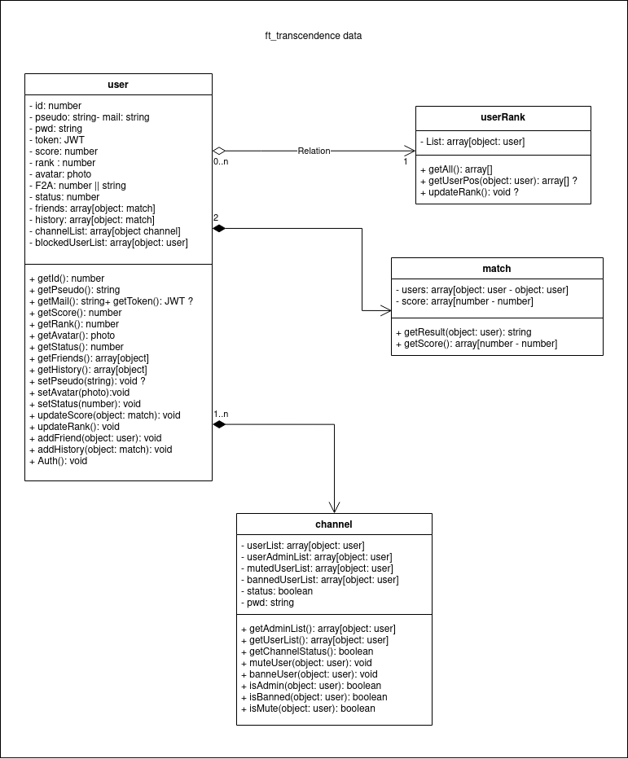

# ft_transcendence

This project is about creating a website for the mighty Pong contest! 

## QUICK START

> git clone https://github.com/nabitbol/ft_transcendence.git
> cd ft_transcendence
> create ./environnement/you_file_name.env check templates [here](https://github.com/nabitbol/ft_transcendence/notes/env_template.md)
> make

## RUN THE PROJECT

> Create at the root of the repository the environnement files:
> - dev.env
> - test.env
> - prod.env
> You can find .env templates by clicking [here](https://github.com/nabitbol/ft_transcendence/notes/env_template.md)
> Run command: `docker-compose --env-file ./environnement/your_file_name.env up -d`

> Access to your app by going to **hostname:port**
> Access the adminer by going to **hostname:15432** for more informations click [here](https://github.com/nabitbol/ft_transcendence/notes/adminer.md)

## HOW IT WORKS

### DATA

