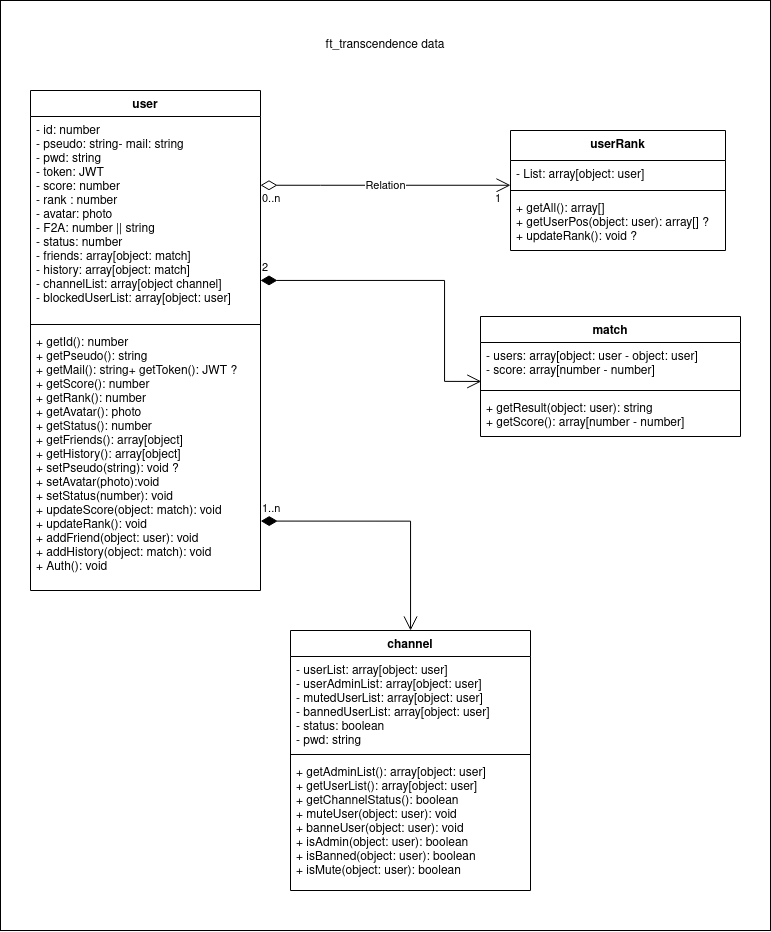

# ft_transcendence

This project is about creating a website for the mighty Pong contest! 

## QUICK START

```bash
git clone https://github.com/nabitbol/ft_transcendence.git && cd ft_transcendence
mkdir environnement && cat notes/templates_env.md > ./environnement/dev.env
make
```

## RUN THE PROJECT

> Create at the root of the repository the environnement files:
> - dev.env
> - test.env
> - prod.env

> You can find .env templates by clicking [here](https://github.com/nabitbol/ft_transcendence/notes/templates_env.md)

> Run command: `docker-compose --env-file ./environnement/your_file_name.env up -d`

> Access to your app by going to **hostname:port**

> Access the pgadmin by going to **hostname:15432** for more informations click [here](https://github.com/nabitbol/ft_transcendence/notes/pgadmin.md)

## HOW IT WORKS

### DATA


