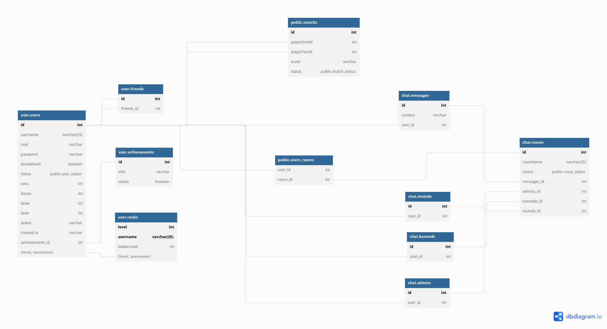
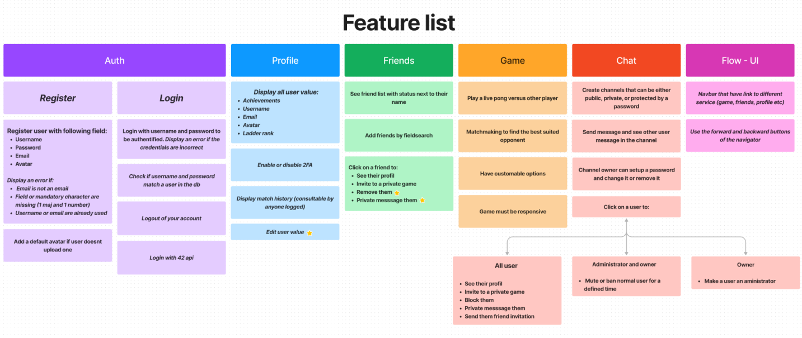
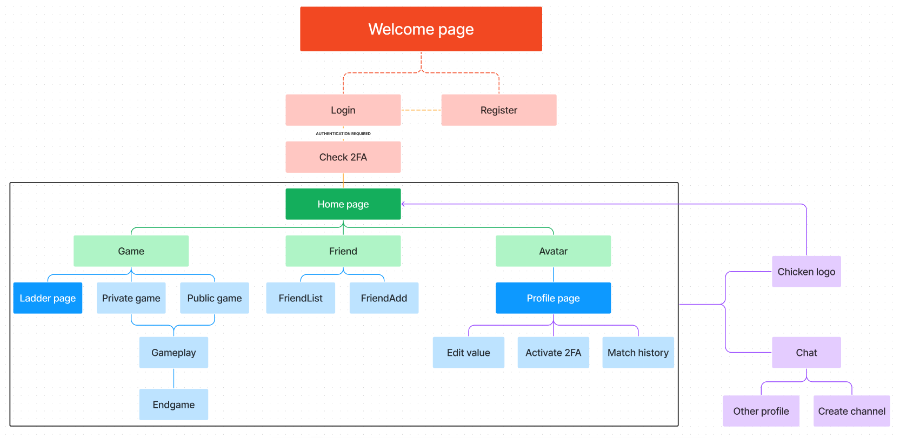
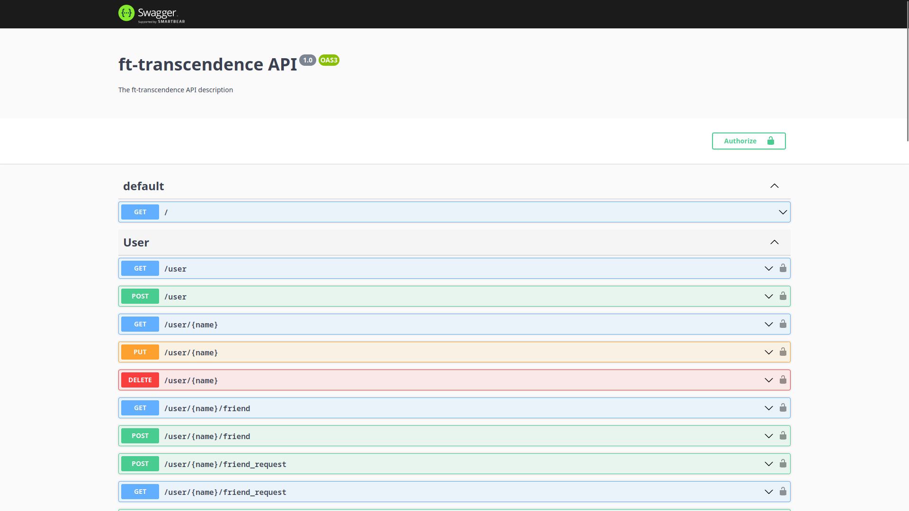
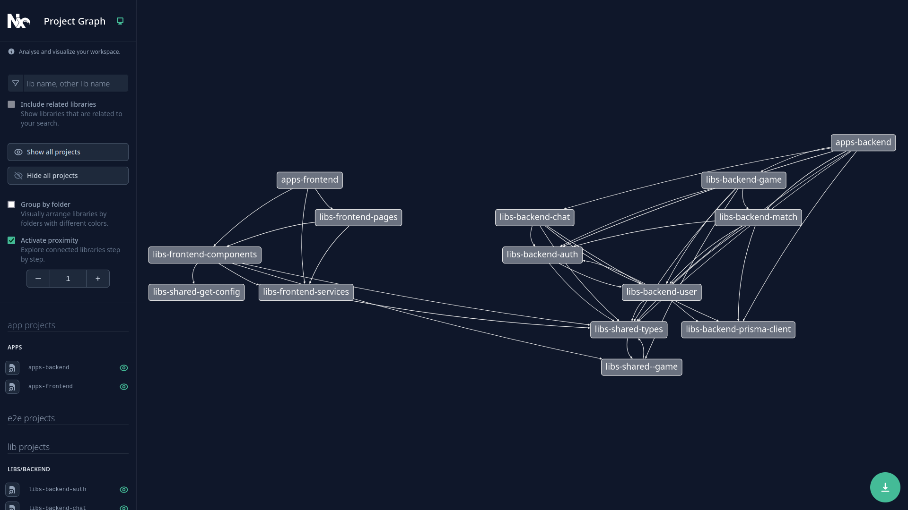

# ft_transcendence

This project is about creating a website for the mighty Pong contest!


## Table of contents
- [ft\_transcendence](#ft_transcendence)
	- [Table of contents](#table-of-contents)
	- [Project description](#project-description)
	- [Stack](#stack)
		- [Tooling](#tooling)
		- [Frontend](#frontend)
		- [Backend](#backend)
	- [Quick start](#quick-start)
		- [Tips and tricks](#tips-and-tricks)
	- [Our approach](#our-approach)
		- [Github project :](#github-project-)
		- [Review :](#review-)
		- [Monorepo :](#monorepo-)
		- [Conception :](#conception)
		- [Implementation :](#implementation)
	- [Contributors](#contributors)

## Project description

This is the final project of the 42_cursus. 

The aim of this project is to create a SPA. (more informations about Single Page Application here: https://developer.mozilla.org/en-US/docs/Glossary/SPA).

This is a fullstack typescript project, with 2fa auth, jwt access token and much more !

The goal of the project is to have people play a pong game live simultaneously. 

The client is able to:
 - Create an account or connect with his 42 credentials
 - Chat with others users, add them as friends
 - Check their profile
 - Unlock new exciting achievement
 - and forth...


## Stack

### Tooling

- First set up
  - Yarn Workspace (For monorepository)
  - Husky (For precommit hooks check code coverage + lint code)
  - Jest (Test the code)
  - Eslint (Lint the code)
  - PostgreSQL (database)
  - Docker/Docker-compose (Automate deployement)

We decided to change for a cleaner setup that would greatly improve the maintenance of the project.

- Second set up
  - Nx (For monorepository)
  - Swagger (Documentation for the Api)
  - Eslint (Lint the code)
  - Jest (Test the code)
  - PostgreSQL (database)
  - Docker/Docker-compose (Automate deployement)

### Frontend

- React
- Css modules
- Typescript
- Websockets

### Backend

- Nestjs
- Prisma
- Open APi
- Websockets

## Quick start

Create a .env file at the root of the repository.

Copy the content of template_env.txt located in the notes directory.

The environnement variable NX_HOST_NAME and HOME_PATH are mandatory and should be filled with the following:
- HOME_PATH: the path of this repository, use pwd.
- NX_HOST_NAME: localhost or 0.0.0.0.

You will be missing a few variables that are client related such as: NX_API_URL, NX_CLIENT_ID and NX_CLIENT_SECRET. The application will still work fine, but the connection with 42 won't work. If you want 42 api connexion to work, you will need to create an application on 42 intra and copy the credentials in .env.

When the .env file is done, you can launch the application:

```bash
docker-compose up -d --build
```

### Tips and tricks

> To get the api documentation go on `http://${hostname}:${port}/doc`
Check the logger in the backend container for precise informations.

> If your port is already in use do not panic, simply use Scan port: `lsof -i -P -n | grep ${port}` to check which process uses it and use `kill -9 process_id` to kill the process. You can also change the port in the .env file.

> Sometime your computer time could be unsynchronized and this can lead to some issues regarding the validity of the 2fa qr code. To fix this problem use `hwclock -s`.

> You can use a database manager like DBeaver to connect to the database and check table creation or the content of your entities.


## Our approach

### Github project :
- We decided to use github kanban board to create task and be more efficient with the repartition of the work.

### Conventional commit :
- We used conventional commits for clarity and manageability. (more informations about conventional commits here: https://www.conventionalcommits.org/en/v1.0.0/)

### Review :
- We protected the main branch and used mandatory review to keep clean code at all time.

### Monorepo :
- We also decided to use a monorepo to increase our developping speed and avoid boilerplate code. (more informations about monorepos here: https://monorepo.tools/)

## Conception

- We started by designing our relationnal database using dbdiagram. (more informations about dbdiagram here: https://dbdiagram.io/home)



- Then we listed all the feature that the application needed to have:



- Using the feature list, we defined the flow of the application:



- Finally we designed each page with a wireframe, you can find it in assets/notes.assets/project.visualisation.assets/.

## Implementation

- We used swagger to create a documentation of the api, it can use jwt access token.



- We used Nx graph to get a good overview of our project.
  


## Contributors

<a href="https://github.com/nabitbol/ft_transcendence/graphs/contributors">
  
</a>
