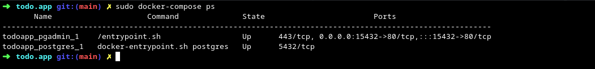

# ADMINER USAGE

# DEPLOYEMENT

> You can deploy the application using `docker-compose up -d`

> Then check the containers status using `docker-compose ps`

# LOGIN

> Now open your web browser and go to the **hostname:15432** you would get the login page

> The fill the fields with your `PGADMIN_EMAIL` and `PGADMIN_PASSWORD`

# ADD DATABASE

> Click Add New Server under Quick Links

> Enter a **Name** the value can be anything

> Go under **Connection** and enter the **Host name/adress**, **Username** and the **Password**
> - For Host name/address, the value is the Docker Compose database service name, in our case is postgres.
> - For the **Username** use the one store in your environnement variable `POSTGRES_USER`
> - Same for the **Password** `POSTGRES_PASSWORD`

> And click Save to finish. After you can get access to the database from the sidebar.

